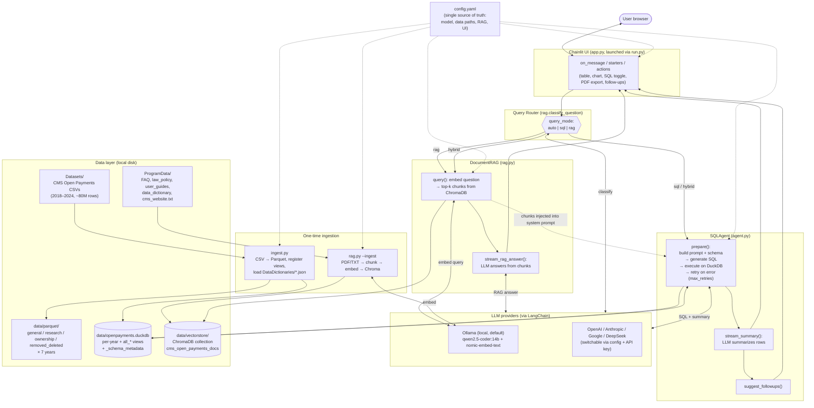

# Current POC Architecture — Open Payments Data Analyst

End-to-end picture of what exists in the repo today (not the to-be design in `to-be-architecture-plan.md`).

## One-line summary

A local Chainlit chat app routes each question to **SQL** (Text-to-SQL over DuckDB/Parquet) or **RAG** (vector search over CMS PDFs), then streams an LLM-generated answer back to the browser.

## End-to-end diagram

## Request lifecycle (happy path)

1. **Launch.** `python run.py` patches `nest_asyncio.apply` to a no-op (Py 3.14 fix), calls `ingest.refresh_views()` to rewrite DuckDB view paths for the current machine, renders `chainlit.md` with live row counts, then execs `chainlit run app.py`.
2. **Session start.** `@cl.on_chat_start` constructs a `SQLAgent`, probes `DocumentRAG.is_available()`, and stashes both in `cl.user_session`.
3. **User sends a question.**
4. **Route.** `classify_question` asks the LLM to return `sql` / `rag` / `hybrid`. Manual override via the settings toggle (`query_mode`).
5. **SQL path.** `SQLAgent.prepare` builds a schema-aware prompt from `_schema_metadata`, calls the SQL LLM, strips markdown, runs on DuckDB, retries up to `max_retries` on error (self-correction history shown as a `cl.Step`). Non-empty DataFrame → `stream_summary` streams tokens into `cl.Message`; result table → `cl.Dataframe`; shape-appropriate chart → `cl.Plotly`.
6. **RAG path.** `DocumentRAG.query` embeds the question with `nomic-embed-text`, fetches top-k chunks from Chroma, dedupes by (file, page). `build_rag_prompt` wraps chunks into `RAG_ANSWER_PROMPT`; `stream_rag_answer` streams the cited answer.
7. **Hybrid path.** RAG chunks are prepended to the SQL agent's system prompt for this turn only, then the SQL path runs.
8. **After answer.** Follow-ups (`suggest_followups`), Show-SQL toggle, export-PDF, and thumbs-up/down actions attach to the message.

## Components at a glance

| Layer | File(s) | Responsibility |
|---|---|---|
| Launcher | `run.py` | nest_asyncio workaround, view refresh, readme render |
| Chat UI | `app.py`, `chainlit.md.template`, `public/` | Chainlit handlers, steps, tables, charts, actions, PDF export |
| Orchestration | `agent.py` (`SQLAgent`) | Multi-provider LLM factory, schema prompt, SQL self-correction loop, streaming summaries, follow-ups |
| Retrieval | `rag.py` (`DocumentRAG`, `classify_question`) | PDF/TXT chunking, Ollama embeddings, ChromaDB store, LLM router |
| Ingestion | `ingest.py` | CSV→Parquet (snappy), DuckDB views per year + `all_*`, `_schema_metadata` from `DataDictionaries/*.json` |
| Storage | `data/parquet/`, `data/openpayments.duckdb`, `data/vectorstore/` | Columnar data, SQL catalog, vector index |
| Config | `config.yaml` | Model/provider, paths, RAG params, UI toggles |
| Diagnostics | `diagnose_rag.py`, `smoke-test-agent.py` | Environment checks and agent smoke test |

## Key design choices (as implemented)

- **DuckDB on Parquet, not a server DB.** In-process, zero admin, queries ~80M rows in-memory-mapped. Views are rewritten at startup so the `.duckdb` file is portable across machines.
- **Ollama-first, cloud-optional.** Default zero-cost local setup; `create_llm` switches to OpenAI/Anthropic/Google/DeepSeek via the provider field in `config.yaml`.
- **Self-correcting Text-to-SQL.** On DuckDB error the prior SQL + error are fed back for up to `max_retries` attempts; the full attempt history renders in the UI step.
- **RAG decoupled from SQL.** Separate vector store, separate ingestion command (`python rag.py --ingest`), separate prompt template. Router decides per-question; hybrid injects context without replacing SQL.
- **Single config file.** Every tunable (model name, temperatures, retries, chunk sizes, UI toggles) lives in `config.yaml` so no code change is needed to swap models or paths.
